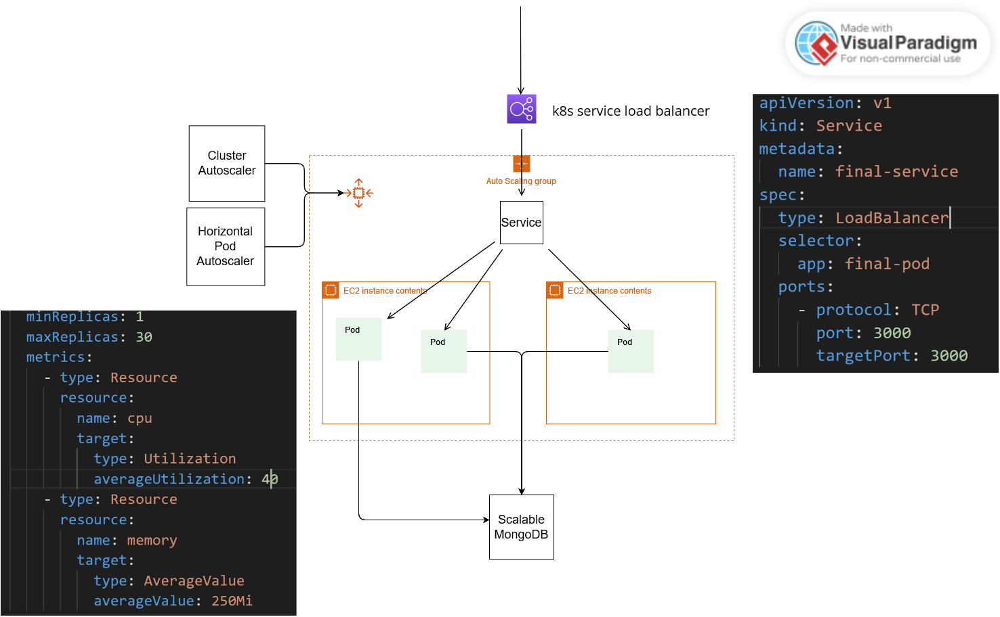

# Fakebook

# Introduction
This is a group final project, and I was in charge of deploying this website onto AWS EKS. Therefore, in this README file, I'll only focus on introducing a directory, `eks_yaml_file`, which contains all the EKS-related files.

# Architeture 
The overall architecture is shown in the following picture.



The architecure is quite simple. We have our entire program packed into one pod. (Of course, this may be a bad approach. We should probably at least separate the front-end code from the back-end code, or even go further and divide the program into several small pieces and pack them into different pods. Therefore, the unit of scaling can be minimized. However, we were out of time to do so.) We have a "service" k8s component associated with the "deployment" managing our pods. We also have a "Horizontal Pod Autoscaler" and a "Cluster Autoscaler" help scaling up and down if necessary.


# Horizontal Pod Autoscaler
Please refer to `eks_yaml_file/final-hpa.yaml`. HPA will monitor resource utilization rate (e.g, CPU, memory usage) and increase the number of the pods if necessary.

```
.
.
.
spec:
  scaleTargetRef:
    apiVersion: apps/v1
    kind: Deployment
    name: final-deployment
  minReplicas: 1
  maxReplicas: 30        # Maximal and minimal number of pods for the corresponding deployment named "final-deployment"
  metrics:
    - type: Resource
      resource:
        name: cpu
        target:
          type: Utilization
          averageUtilization: 40  # The HPA will monitor the CPU usage of the pods and adjust the number of replicas to maintain an average utilization close to the defined target 40%.
    - type: Resource
      resource:
        name: memory
        target:
          type: AverageValue      # Similar rule as the case of CPU.
          averageValue: 250Mi
```

# Cluster Autoscaler
Please refer to `eks_yaml_file/final-cluster-autoscaler.yaml`.

# LoadBalancer
Please refer to `eks_yaml_file/final-service.yaml`. 
